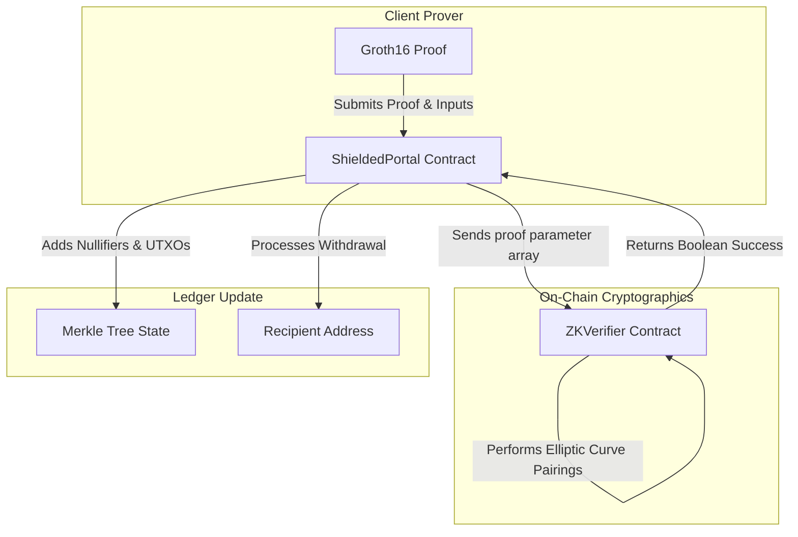

# StellarZK Contracts: On-Chain Zero-Knowledge Proof Verifiers

[](https://www.drips.network/wave)
[](https://www.rust-lang.org/)
[](https://opensource.org/licenses/Apache-2.0)

**High-performance Soroban smart contracts implementing mathematical Groth16 zero-knowledge proof verification and shielded asset pool custody.**

---

# 🔐 Technical Overview

`stellarzk-contracts` implements the on-chain verification foundation of the StellarZK privacy suite. By executing mathematical pairing equations directly inside the **Soroban Host Environment**, these contracts can verify client-side generated zk-SNARK proofs securely without revealing any underlying data.

### Core Contracts:
1.  **`ZKVerifier`:** A gas-optimized Groth16 proof verifier. It accepts proof parameters (`pi_a`, `pi_b`, `pi_c`) and public inputs, performing pairing checks over the BN254 elliptic curve.
2.  **`ShieldedPortal`:** The shielded liquidity pool contract. It accepts shielded deposits, registers on-chain commitments (UTXO-like structure in an incremental Merkle Tree), and processes private transfers or shielded withdrawals once verified by the `ZKVerifier` contract.

---

# 🏗️ Internal Architecture & Verification Flow



---

# 📋 Mathematical & Cryptographic Specifications

### 1. Elliptic Curve Pairings over BN254
The `ZKVerifier` contract processes pairing operations over the **BN254 curve** (also known as alt_bn128). Verification of a Groth16 proof requires evaluating the following cryptographic pairing equation:

$$e(A, B) \cdot e(- \alpha, \beta) \cdot e(- \sum \frac{x_i \cdot \gamma_i}{\delta}, \delta) \cdot e(-C, \delta) = 1$$

Where:
*   $A \in \mathbb{G}_1$, $B \in \mathbb{G}_2$, $C \in \mathbb{G}_1$ represent the proof coordinates.
*   $\alpha \in \mathbb{G}_1$, $\beta \in \mathbb{G}_2$, $\gamma_i \in \mathbb{G}_2$, $\delta \in \mathbb{G}_2$ represent the verification key coordinates.
*   $x_i$ represent the public input variables.

To optimize gas usage within the Soroban VM, pairing checks are performed in a single multi-pairing operation rather than computing individual pairings sequentially.

### 2. Shielded Portal commitment Storage
The `ShieldedPortal` contract maintains an incremental Merkle Tree of height **32** to register deposit and transfer commitments. Commitments are stored as Poseidon hashes of the UTXO secrets:

```rust
#[derive(Clone, Debug, Eq, PartialEq)]
pub struct Commitment {
    pub hash: BytesN<32>,
    pub index: u32,
}
```

To withdraw or transfer assets:
1.  **Merkle Path Proof:** The caller provides a membership proof demonstrating their commitment hash exists within the incremental Merkle Tree root.
2.  **Nullifier Registration:** The caller provides a `nullifier` hash derived from their secret key and UTXO index. The contract checks if the `nullifier` exists in its persistent map to prevent double-spending. If the nullifier is unique, it is marked as `spent: true`.

---

# 📋 ZK-SNARK Mathematical Configuration

The contracts use the **Groth16 protocol** over the **BN254 curve**. Public inputs are structured as follows during verification calls:

| Parameter | Type | Representation | Purpose |
| :--- | :--- | :--- | :--- |
| **`proof_a`** | `BytesN<64>` | G1 Elliptic Curve Point | Mathematical witness point `A`. |
| **`proof_b`** | `BytesN<128>`| G2 Elliptic Curve Point | Mathematical witness point `B`. |
| **`proof_c`** | `BytesN<64>` | G1 Elliptic Curve Point | Mathematical witness point `C`. |
| **`public_inputs`**| `Vec<Val>` | Array of field elements | Public commitments, nullifiers, and asset values. |
| **`nullifier`** | `BytesN<32>` | Unique Hash | Prevents double-spend of shielded assets. |

---

# 📂 Repository Structure

```text
stellarzk-contracts/
├── contracts/
│   ├── zk_verifier/      # Groth16 verification equations and pairing operations
│   │   └── src/
│   │       ├── lib.rs    # Pairing evaluation and verification checks
│   │       └── curve.rs  # BN254 elliptic curve coordinates definitions
│   └── shielded_portal/  # Merkle Tree state, UTXO commitments, and shielded pool custody
├── Cargo.toml            # Workspace manifest
└── README.md             # You are here
```

---

# 🛠️ Development, Compilation & Testing

### 1. Prerequisites
Ensure you have the following installed locally:
*   Rust (v1.75+) with `wasm32-unknown-unknown` target.
*   Stellar CLI (v21.0.0+) for contract deployments and sandboxing.

### 2. Local Setup & Building
Clone the repository and compile the workspace WASM files:
```bash
git clone https://github.com/stellarzk-phantom/stellarzk-contracts.git
cd stellarzk-contracts
cargo build --target wasm32-unknown-unknown --release
```
Optimized contract binaries will be output to `target/wasm32-unknown-unknown/release/`.

### 3. Running Unit Tests
To execute the comprehensive ZK verifications and Merkle Tree logic unit tests:
```bash
cargo test
```

---

# 📄 License

This project is licensed under the **Apache License 2.0**.
