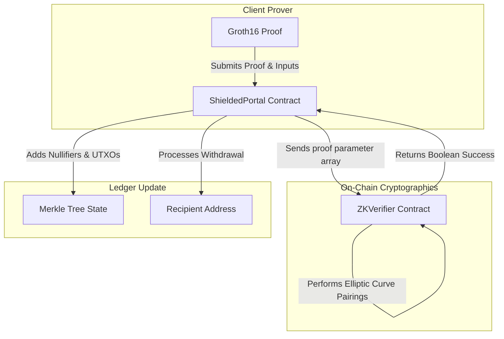

# StellarZK Contracts: On-Chain Zero-Knowledge Proof Verifiers

[](https://www.drips.network/wave)
[](https://www.rust-lang.org/)
[](https://opensource.org/licenses/Apache-2.0)

**High-performance Soroban smart contracts implementing mathematical Groth16 zero-knowledge proof verification and shielded asset pool custody.**

---

# 🔐 Technical Overview

`stellarzk-contracts` implements the on-chain verification foundation of the StellarZK privacy suite. By executing mathematical pairing equations directly inside the **Soroban Host Environment**, these contracts can verify client-side generated zk-SNARK proofs securely without revealing any underlying data.

### Core Contracts:
1.  **`ZKVerifier`:** A gas-optimized Groth16 proof verifier. It accepts proof parameters (`pi_a`, `pi_b`, `pi_c`) and public inputs, performing pairing checks over the BN254 elliptic curve.
2.  **`ShieldedPortal`:** The shielded liquidity pool contract. It accepts shielded deposits, registers on-chain commitments (UTXO-like structure in an incremental Merkle Tree), and processes private transfers or shielded withdrawals once verified by the `ZKVerifier` contract.

---

# 🏗️ Internal Architecture



---

# 📋 ZK-SNARK Mathematical Configuration

The contracts use the **Groth16 protocol** over the **BN254 curve**. Public inputs are structured as follows during verification calls:

| Parameter | Type | Representation | Purpose |
| :--- | :--- | :--- | :--- |
| **`proof_a`** | `BytesN<64>` | G1 Elliptic Curve Point | Mathematical witness point `A`. |
| **`proof_b`** | `BytesN<128>`| G2 Elliptic Curve Point | Mathematical witness point `B`. |
| **`proof_c`** | `BytesN<64>` | G1 Elliptic Curve Point | Mathematical witness point `C`. |
| **`public_inputs`**| `Vec<Val>` | Array of field elements | Public commitments, nullifiers, and asset values. |
| **`nullifier`** | `BytesN<32>` | Unique Hash | Prevents double-spend of shielded assets. |

---

# 📂 Repository Structure

```text
stellarzk-contracts/
├── contracts/
│   ├── zk_verifier/      # Groth16 verification equations and pairing operations
│   └── shielded_portal/  # Merkle Tree state, UTXO commitments, and shielded pool custody
├── Cargo.toml            # Workspace manifest
└── README.md             # You are here
```

---

# 🛠️ Development & Contributing

### Local Setup
1. **Clone the Repo:** `git clone https://github.com/stellarzk-phantom/stellarzk-contracts.git`
2. **Build Workspace:** `cargo build --target wasm32-unknown-unknown --release`
3. **Run Unit Tests:** `cargo test`

---

# 📄 License

This project is licensed under the **Apache License 2.0**.
